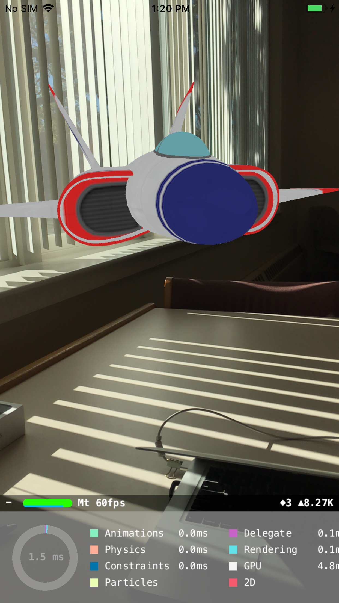
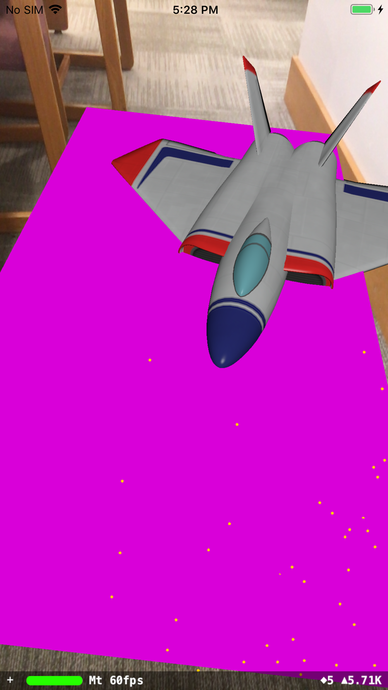
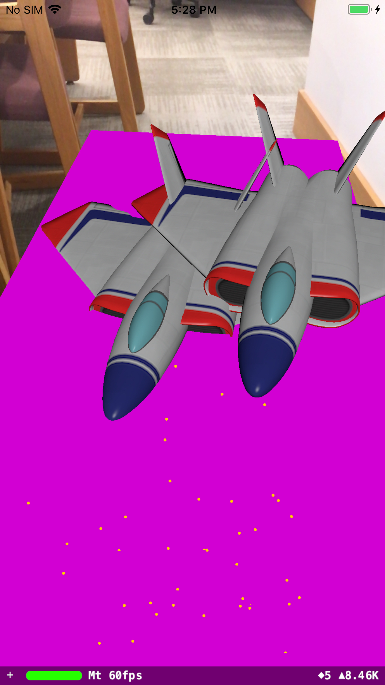

# HelloARWorld

First Augmented Reality app build by following https://mobile-ar.reality.news/how-to/arkit-101-get-started-building-augmented-reality-application-iphone-ipad-quickly-0177989/, which walks through creating an AR Project on XCode.

##### 1. Simple 3D model viewing without surface detection or other interactions

##### 2. Surface Detection and drawing ships when tapped
https://blog.markdaws.net/arkit-by-example-part1-7830677ef84d

